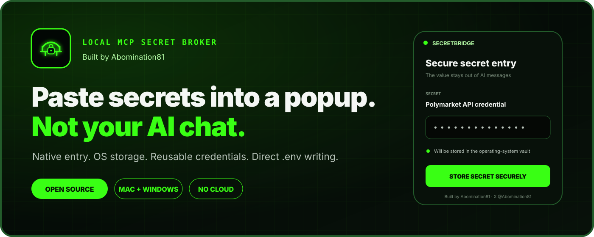
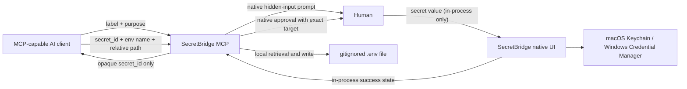

# SecretBridge MCP

[](https://github.com/abomination81/secret-bridge-mcp/actions/workflows/ci.yml)
[](https://github.com/Abomination81/secret-bridge-mcp/releases/latest)
[](LICENSE)

**Built by [Abomination81](https://github.com/Abomination81) · [X @Abomination81](https://x.com/Abomination81)**



SecretBridge lets an AI request a credential without asking you to paste it into chat. It opens a native password dialog, stores the value in macOS Keychain or Windows Credential Manager, and returns only an opaque ID through MCP. It is a local application: it has no server, account, telemetry, or network listener.

The model can later ask SecretBridge to place selected credentials into an approved local `.env` file. Secret values never appear in MCP requests, responses, labels, metadata, or audit logs.

**[Open the visual installation guide](https://abomination81.github.io/secret-bridge-mcp/)**

## What it protects



There is deliberately no `secret_get`, `secret_reveal`, clipboard, HTTP, or network tool.

## MCP tools

- `secret_request`: shows a hidden-input popup, stores a new value, or reuses an existing label. The result contains only an opaque `secret_id`.
- `secret_list`: returns non-sensitive labels, purposes, IDs, and timestamps.
- `env_write`: shows a second approval and merges selected secrets into `.env`, `.env.*`, or `.dev.vars` beneath one configured workspace.
- `secret_delete`: shows a confirmation and removes the stored credential and its metadata.

After a new value is submitted and OS storage succeeds, `secret_request` explicitly returns:

```json
{
  "status": "stored",
  "user_confirmed": true,
  "secret_received": true,
  "secret_stored": true,
  "safe_to_continue": true,
  "secret_id": "sb_..."
}
```

The accompanying MCP message tells the AI that secure entry was confirmed and it can continue. An existing credential instead returns `status: "reused"` without claiming that the user entered it again. Neither response contains the secret value.

`env_write` also:

- rejects absolute paths, `..`, symlink targets/parents, and paths outside the configured workspace;
- refuses committable templates such as `.env.example`, targets already tracked by Git, and targets Git does not report as ignored;
- rejects client-bundled prefixes such as `NEXT_PUBLIC_`, `VITE_`, and `REACT_APP_`;
- adds safe `.env*`/`.dev.vars` ignore rules and template exceptions to the workspace `.gitignore` when needed;
- refuses a symlinked `.gitignore`, caps existing env files at 1 MiB, writes mode `0600` on macOS, and preserves unrelated existing variables;
- records only metadata in a local audit log.

Credentials are granted to the workspace where they are first requested. Reuse there is automatic. Reuse from another workspace requires a one-time native approval; every `.env` write still gets its own approval.

## Install from GitHub

SecretBridge currently uses a source-first installation so macOS Gatekeeper and Windows SmartScreen do not have to trust an unsigned downloaded executable. Install [Rust](https://www.rust-lang.org/tools/install), then:

### macOS

```sh
git clone https://github.com/abomination81/secret-bridge-mcp.git
cd secret-bridge-mcp
./scripts/install.sh
```

The executable is installed at `~/.local/bin/secret-bridge-mcp` unless `SECRET_BRIDGE_INSTALL_DIR` is set.

### Windows PowerShell

```powershell
git clone https://github.com/abomination81/secret-bridge-mcp.git
Set-Location secret-bridge-mcp
.\scripts\install.ps1
```

The executable is installed under `%LOCALAPPDATA%\SecretBridge` unless `SECRET_BRIDGE_INSTALL_DIR` is set.

## Build from an existing checkout

Install a current stable Rust toolchain, then run:

```sh
cargo build --locked --release
```

The build produces one executable: `secret-bridge-mcp` (or `secret-bridge-mcp.exe` on Windows). A connected broker never creates a native window. For each active request it launches a one-shot prompt process from that same executable. The parent sends only validated display metadata over the child's stdin; the secret value is entered and stored directly in the OS credential store inside the child, and the parent receives only an exit status. The child process terminates after submission or cancellation, so the operating system destroys its window. There is no separate helper binary and no channel that carries a secret value.

Convenience installers build the locked dependency graph from source and copy the executable to a user-local directory:

```sh
./scripts/install.sh
```

```powershell
.\scripts\install.ps1
```

No API key or secret is needed to build or run the MCP server itself.

## Configure an AI client

Use an absolute binary path and an absolute workspace root. Configure one server entry per workspace so `.env` writes stay narrowly scoped.

### Codex and the ChatGPT desktop app

```sh
codex mcp add secret-bridge -- /absolute/path/to/secret-bridge-mcp --workspace-root /absolute/path/to/project --client-name Codex
```

Equivalent `~/.codex/config.toml`:

```toml
[mcp_servers.secret-bridge]
command = "/absolute/path/to/secret-bridge-mcp"
args = ["--workspace-root", "/absolute/path/to/project", "--client-name", "Codex"]
default_tools_approval_mode = "writes"
```

The ChatGPT desktop app, Codex CLI, and Codex IDE extension share this configuration on the same Codex host. ChatGPT on the web cannot launch a local stdio executable; it needs a hosted plugin or remote MCP service instead. See the [official Codex MCP documentation](https://developers.openai.com/codex/mcp/).

### Claude Code

```sh
claude mcp add --scope user --transport stdio secret-bridge -- /absolute/path/to/secret-bridge-mcp --workspace-root /absolute/path/to/project --client-name "Claude Code"
```

### Claude Desktop and other JSON-configured clients

```json
{
  "mcpServers": {
    "secret-bridge": {
      "command": "/absolute/path/to/secret-bridge-mcp",
      "args": [
        "--workspace-root",
        "/absolute/path/to/project",
        "--client-name",
        "Claude Desktop"
      ]
    }
  }
}
```

### Gemini CLI

Add this to Gemini CLI's `settings.json` and keep `trust` set to `false` so the client also asks before tool calls:

```json
{
  "mcpServers": {
    "secret-bridge": {
      "command": "/absolute/path/to/secret-bridge-mcp",
      "args": [
        "--workspace-root",
        "/absolute/path/to/project",
        "--client-name",
        "Gemini CLI"
      ],
      "trust": false
    }
  }
}
```

The same stdio entry works with any local MCP host—including future Grok or other clients—when that host supports launching local stdio servers. A web-only chat cannot create a native popup on your computer without a local companion process.

### Make SecretBridge the default for credentials

After registering the MCP above, run this once from the repository checkout:

```sh
# macOS: enable for both Codex and Claude Code
sh ./scripts/enable-defaults.sh both
```

```powershell
# Windows: enable for both Codex and Claude Code
.\scripts\enable-defaults.ps1 both
```

Use `codex` or `claude` instead of `both` to configure only one client. The scripts install the shared [credential instructions](docs/client-instructions.md) in the clients' user-level instruction files. They preserve existing preferences and update only their marked section when rerun. They respect `CODEX_HOME` and `CLAUDE_CONFIG_DIR`; Codex's nonempty `AGENTS.override.md` is selected when present.

Start a new Codex task or Claude Code session afterward. When a task needs a credential, the AI is instructed to discover SecretBridge, check saved labels, reuse an appropriate credential or open the popup, and use `env_write` for an approved destination. You do not need to mention the MCP in each request. If the tools are unavailable, it helps resolve the connection instead of asking you to paste a key in chat.

These are persistent defaults, not a guarantee of every model decision. They do not change tool permissions, bypass native approvals, or expand the configured workspace. A global MCP entry with a fixed `--workspace-root` still writes only within that root; configure an entry for another project before writing there. Claude Desktop chat does not automatically load Claude Code's `CLAUDE.md`.

To undo the preference, remove just the section between the SecretBridge managed markers in the affected instruction file. MCP registration and saved credentials are separate and remain available. See [Codex instruction discovery](https://developers.openai.com/codex/guides/agents-md/) and [Claude Code memory](https://code.claude.com/docs/en/memory) for client behavior.

### Windows example

JSON paths must escape backslashes:

```json
{
  "mcpServers": {
    "secret-bridge": {
      "command": "C:\\Users\\you\\AppData\\Local\\SecretBridge\\secret-bridge-mcp.exe",
      "args": [
        "--workspace-root",
        "C:\\Users\\you\\src\\my-project",
        "--client-name",
        "AI client"
      ]
    }
  }
}
```

## Example conversation

> Configure Stripe for local development using `.env.local` and `STRIPE_SECRET_KEY`.

With the default credential instructions installed, this is enough; you do not need to remind the AI about SecretBridge.

The AI calls `secret_request`. You see a native dialog labeled, for example, “Stripe test secret key for Acme billing,” paste the value there, and click **Save securely**. The AI receives an ID such as `sb_…`, then calls `env_write`. A second popup shows the full destination and mapping before anything is written.

## Security boundary

SecretBridge is designed to keep the secret out of AI conversations, MCP messages, command history, and logs while it is collected and reused. It is not designed to hide an approved `.env` file from software running on the same computer. An AI client with unrestricted filesystem permissions can potentially read that file. Review the path and variable names in the approval dialog.

On macOS, SecretBridge enables Secure Event Input for the secret window. After a paste event it replaces the clipboard contents with an empty value. These are small hygiene measures, not malware detection.

Windows Credential Manager generic credentials can be read by other processes running as the same Windows user. Protecting a compromised local account is outside SecretBridge's threat model.

See [SECURITY.md](SECURITY.md) for the full threat model and design limits.
Release maintainers must also follow [RELEASING.md](RELEASING.md); locally built binaries are not production release artifacts.

## Development

```sh
cargo fmt --check
cargo test --locked
cargo clippy --locked --all-targets -- -D warnings
```

The stdio server writes only newline-delimited JSON-RPC to stdout. Diagnostics go to stderr. Non-secret metadata is stored under `~/Library/Application Support/SecretBridge` on macOS or `%APPDATA%\SecretBridge` on Windows.

## Updating and uninstalling

To update, pull the latest tagged version and rerun the platform install script. Before uninstalling, use `secret_list` and `secret_delete` to remove any stored credentials you no longer want. Then remove the installed executable and the non-secret metadata directory shown above. Removing an executable does not automatically delete credentials from the operating-system store.

## Contributing and support

See [CONTRIBUTING.md](CONTRIBUTING.md) for development and pull-request guidance. Use [GitHub Issues](https://github.com/abomination81/secret-bridge-mcp/issues) for ordinary bugs. Security reports must follow [SECURITY.md](SECURITY.md) and must never contain a real credential.
